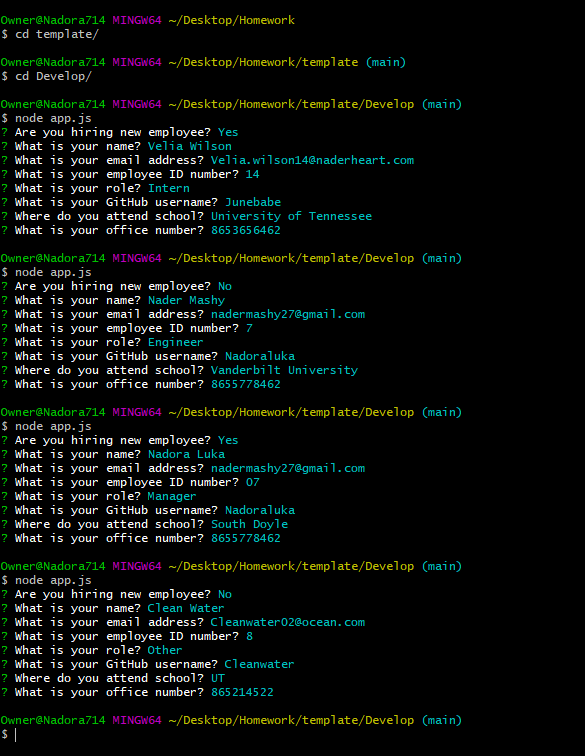

# Template Engine - Team Profile Generator

# Description

The user is able to enter information about different employees to build a team profile. The team profile is generated in an html file and displays each team member as a card with their name, role, ID, email, and other information specific to their role.

## links

https://github.com/NadoraLuka/Team-Profile-Generator
https://nadoraluka.github.io/Team-Profile-Generator/

# Usage

The user initializes the application in the command line with node app.js. The user is prompted to choose what type of employee they would like to create first. The options are intern, manager, and engineer.
The intern option requires the user to input the name, ID, email, and school.
The manager option requires the user to input the name, ID, email, and office number.
The engineer option requires the user to input the name, ID, email, and github username.
Once all the information is collected, the user chooses to create another employee or not by selection "Yes" or "No".
If they choose "Yes", the employee type question appears and they go through the same process.
If they choose "No", the html page is generated with all the employees created.

See below for an example of the prompts in the command line.

